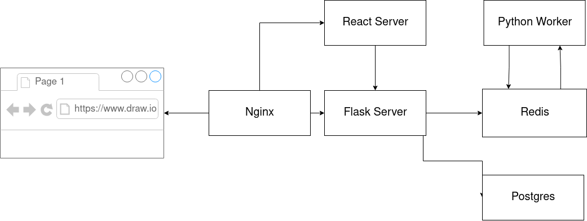
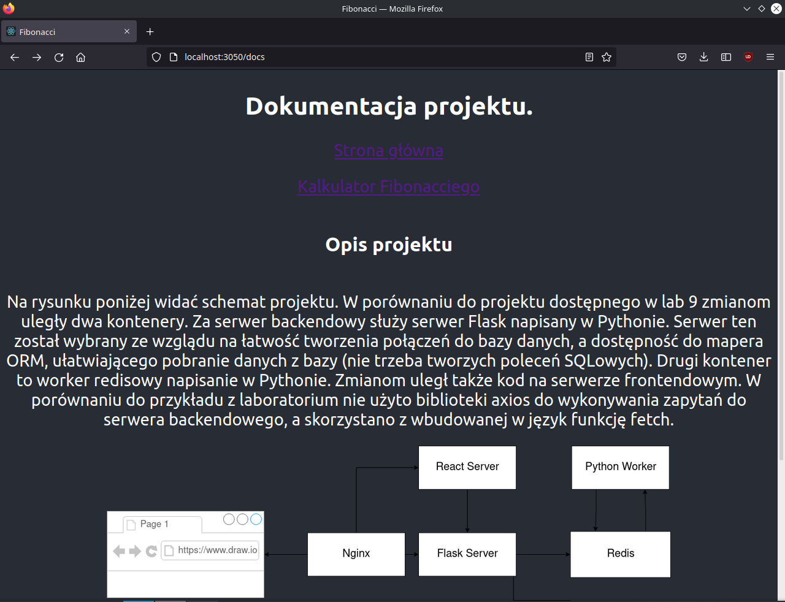

# Multi container application - PFSwCO
## Opis projektu            
Na rysunku poniżej widać schemat projektu. W porównaniu do projektu dostępnego w lab 9 zmianom uległy dwa kontenery.
Za serwer backendowy służy serwer Flask napisany w Pythonie. Serwer ten został wybrany ze wzglądu na łatwość tworzenia
połączeń do bazy danych, a dostępność do mapera ORM, ułatwiającego pobranie danych z bazy (nie trzeba tworzych poleceń SQLowych).
Drugi kontener to worker redisowy napisanie w Pythonie. Zmianom uległ także kod na serwerze frontendowym. W porównaniu do przykładu z 
laboratorium nie użyto biblioteki axios do wykonywania zapytań do serwera backendowego, a skorzystano z wbudowanej w język funkcję fetch.


## Uruchomienie projektu
```docker compose -f docker-compose.dev.yml up```

## Widok uruchomionej usługi



